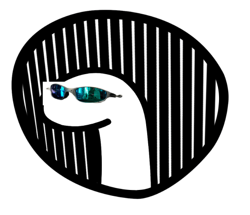

# Deninho bot(em desenvolvimento.)

## Comandos

Todos os comandos devem ser iniciados com ";"

* play - Adiciona a musica a queue e toca ela
* pause - Pausa a musica atual
* resume - Continua a reprodução da musica atual
* skip - Pula para a próxima música
* stop - Para a reprodução de músicas no servidor

## Adicionando o Deninho Dj ao seu server
Para adicionar o Deninho bot ao seu server [clique aqui](https://discord.com/api/oauth2/authorize?client_id=770292054231351296&permissions=8&scope=bot)